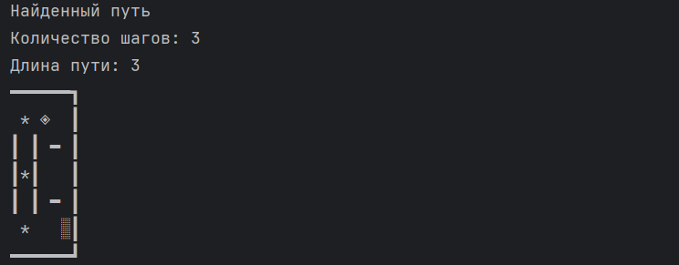

* Three maze generation algorithms have been implemented: Prim's algorithm, Wilson's algorithm, and the woven maze algorithm.
* Two pathfinding algorithms have been implemented: iterative DFS and A-star.
* Various types of surfaces (modifiers) have been implemented.

Examples of operation:

Prim's algorithm, DFS.  
  
Wilson's algorithm, A-Star. The maze is braided. Modifiers have been added.  
Original maze:  
  
Traversed maze:  
  
The entire process:  
  
  

Usage

To generate a maze image and find a path within it, please follow these steps:
1. Enter the maze parameters: height and width. The minimum maze size is 1x1, and the maximum is 50x50.
2. Enter the entry point and exit point. The user will be offered two methods for entering these points: by quadrants and by coordinates.
   Entering by quadrants implies placing the entry/exit in the corners of the selected quadrant. Entering by coordinates is only possible at the boundary cells of the maze. It is not prohibited to enter the entry and exit in the same cell.
3. Choose whether the maze will be woven. A woven maze is a maze without dead ends. Its feature is that, unlike a non-woven or "perfect" maze, multiple paths can be established between any two points.
4. Based on the user’s choice, options will be given to add modifiers to the maze. Modifiers increase or decrease the traversal cost of a cell. There are two types of modifiers: jungles and diamonds. Jungles increase the traversal cost by 2, while diamonds decrease it by 3.
5. If the user agrees to add modifiers, they will be prompted to enter the probability of modifiers appearing on each cell. The total probability of a modifier's appearance is entered. The probability of whether it will be a diamond or a jungle is equal.
6. Choose the maze generation algorithm.
7. Choose the path-finding algorithm from the entry point to the exit.

After entering the input data, an image of the generated maze and an image of the maze with the found path will be displayed. The parameters of the found path will also be shown: path length - the cost of traversing the path considering the modifiers, and number of steps - the number of cells traversed in the maze. If the path is not found, a message will be displayed.